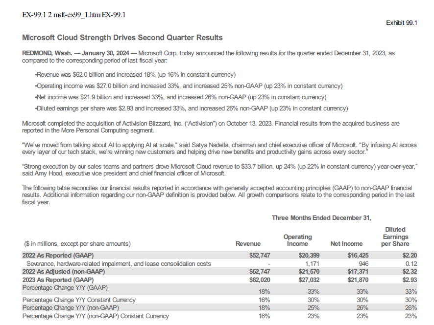

# 10-K, 10-Q, and 8-K Reports from SEC Database
### _Includes Exhibit 99.1 Reports_
 



- SEC Main Page: https://www.sec.gov/
- SEC Developer Resources: https://www.sec.gov/developer

## Overview
The program gets 10-K, 10-Q, or 8-K reports from the SEC database for a selected stock. The user inputs the selected 
stock ticker and the report type.  For the 10-K and 10-Q reports, the user can select the number of reports and a pdf
file will be created.  The 8-K report will extract the exhibit 99.1 link from the report (if it exists) and create a
pdf file.  The exhibit 99.1 will contain company press releases including the quarterly and annual report press 
releases.  It also will contain press releases from other major events.


## Terms
* SEC Form 10-K: an annual report that public companies must file with the Securities and Exchange Commission (SEC) 
to provide a comprehensive summary of their financial performance, including audited financial statements, management 
discussion and analysis, and other disclosures.
* SEC Form 10-Q: a quarterly report that public companies must file with the SEC to provide a summary of their financial 
performance for the past three months, including unaudited financial statements, management discussion and analysis, 
and other disclosures.
* SEC Form 8-K: a report that companies must file with the Securities and Exchange Commission (SEC) to announce major 
events that shareholders should know about.
* SEC Exhibit 99.1: a document that is filed with the Securities and Exchange Commission (SEC) by companies to provide 
additional information about a particular event or transaction.
* CIK: Central Index Key-EDGAR uses this number to identify a Company 
* Ticker: ticker of a stock (example: Microsoft ticker is MSFT)

## Requirements Library
* pandas
* json
* os
* requests
* pdfkit
* beautifulsoup4
* __requires your email address in the headers setup for requests.__  Add your email address prior to running.

```
headers = {
    "User-Agent": "your_email@your_domain.com",  # Your email as the User-Agent
    "Accept-Encoding": "gzip, deflate"
}
```  
* (optional) hide your email:
  - create a py file with the following:
```
- hide_email = {
    'my_email': "your_email@your_domain.com"
}
```
- Add from file.py import hide_email
   - EMAIL = hide_email.get('MY_EMAIL')
   - Include the following in functions.py:
```
# Used to hide my email
from email import hide_email
EMAIL = hide_email.get('MY_EMAIL')

headers = {
    "User-Agent": "EMAIL",  # Your email as the User-Agent
    "Accept-Encoding": "gzip, deflate"
}

```

## Notes on pdfkit
* requires _wkhtmltopdf_ to be installed 
* This is a setup for a Windows environment, not sure if it works in other operating systems.
```
path_wkhtmltopdf = r"C:\Program Files\wkhtmltopdf\bin\wkhtmltopdf.exe" # is the path to the executable
config = pdfkit.configuration(wkhtmltopdf=path_wkhtmltopdf)' # sets configuration
pdfkit.from_string(html_content, pdf_file, configuration=config, options={"enable-local-file-access": ""}) 
```

## Functions Overview
1) User Input Setup: enter stock ticker, desired report, and number of reports
    function: user_inputs
    * Input parameters (by user):
        - Input a ticker (example: AMZN)
        - Report Type (10-K, 10-Q, 8-K)
    * Outputs:
        - Ticker
        - Report type

2) Get CIK for ticker and generate url for report filings
    * function: ticker_to_cik
    * input: ticker
    * output: url for report filings, cik

3) Convert filings dictionary to pandas
    * function: filings_to_df
    * Input: url
    * Output: company_filings_df

4) Filter df report for either 10-K, 10-Q, or 8-K
    * function: filter_reports
    * Input: company_filings_df
    * output: reports_filtered

5) Iterate through links and create pdf file of report
    * 10-K and 10-Q
      - functions: access_reports, webpage_to_pdf
      - Inputs: report_filtered, cik, report, ticker, output_folder
      - Outputs: pdf file saved to reports_folder.  File format *ticker-date-report.pdf*
    * 8-K
      - functions: access_reports, get_href_links, webpage_to_pdf
      - Inputs: report_filtered, cik, report, ticker, output_folder
      - Outputs: pdf file of exhibit 99.1 saved to reports_folder.  File format *ticker-date-report.pdf*

* Additional: run utilities.py file to download the 'company_tickers_exchange.json' file

#### Notes
* Program can be customized
* Future: add webpage interface